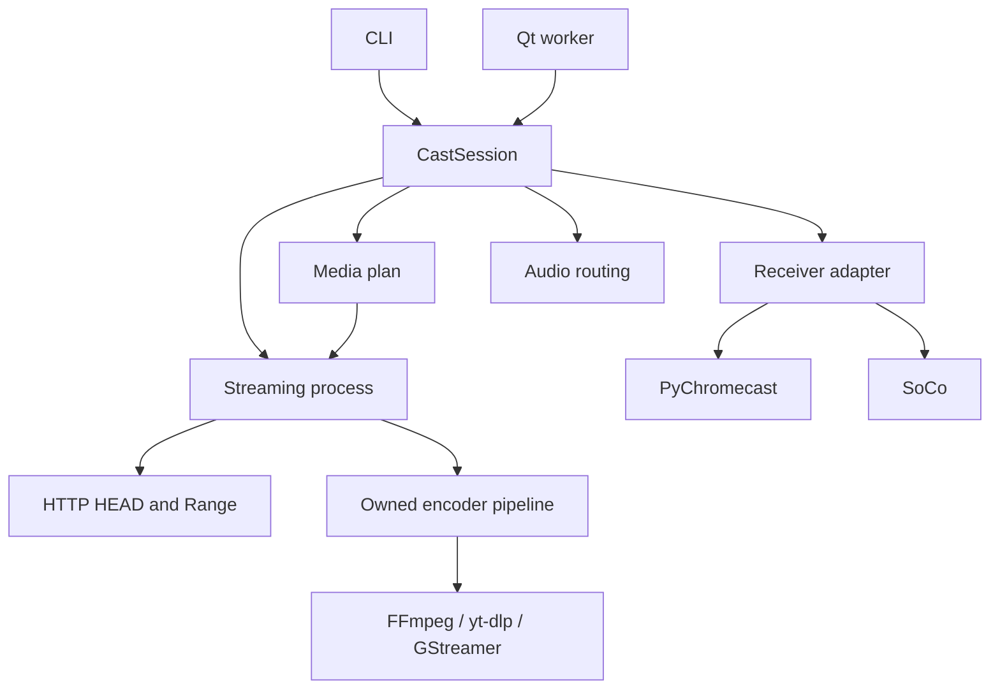

# 2.0.0a1 implementation status

Date: 2026-10-08. Baseline: `aad239c9adb12fbed9a841d15d4a6d6ddc5de5e8`.
Work branch: `modernization/stability-foundation`.

This is the first implementation increment following the repository audit.
It preserves the Python application, PyChromecast transport, FFmpeg/GStreamer
builders and Qt UI. It replaces duplicated lifecycle code around those components.
It does not claim completion of the entire 2.0 roadmap.

## Architecture implemented

`Mkchromecast` remains the legacy settings facade; it is not yet an immutable
configuration model. CLI argument parsing happens at the entry point. Tray
workers receive explicit settings instead of importing a global cast instance.
`CastSession` coordinates preparation, device discovery, routing, server readiness,
playback, cancellation and cleanup. Start failure closes every resource already
acquired. Close is idempotent and attempts remaining cleanup after an error.

The Flask facade remains class-based inside one dedicated **spawn** process per
session. This avoids inheriting Qt/GLib/network threads across a fork. Its parent
waits for an IPC readiness message before sending the media URL to the receiver.
Missing static encoder executables and occupied ports fail startup. The server
reports encoder errors through IPC to the session. Media subprocess stderr is
bounded and URL strings are redacted from reported diagnostics.

`Casting` owns its mDNS browser, Zeroconf instance and selected Cast connection.
Discovery lists IDs without opening every receiver's media connection. Selection
uses UUID or a unique friendly name. `SonosCasting` is optional and resolves group
coordinators. Stop checks the current media URI before interrupting playback.

## Changes by component

| Component | Implemented in this increment |
| --- | --- |
| Packaging | PEP 517/621 metadata, declared runtime dependencies and feature extras, console/module entry points, packaged tray icons and getch package, build/test targets |
| Discovery | Bounded CastBrowser discovery, stable IDs, duplicate-name error, explicit disconnect and discovery teardown |
| Media | ffprobe stream-type inspection; direct compatible MP4 versus transcoding; matching yt-dlp output MIME; explicit HDR rejection |
| FFmpeg | Optional audio stream mapping, AAC in MP4, one subtitles/scale filter chain, escaped subtitle paths, corrected 480p and case-normalized resolution, removal of deprecated Pulse frame_size and invalid ALSA fragment options |
| HTTP/processes | No encoder on HEAD, conditional file Range, one live consumer, disconnect cleanup, readiness/error IPC, bounded terminate/kill for owned subprocesses; no global pkill |
| Audio routing | Unique Linux sink/module ownership; macOS previous input/output restoration, including partial startup failure |
| yt-dlp | HTTP(S) URLs including short URLs, explicit producer/encoder pipe, no shell pipeline, declared MP3 or MP4 output |
| Sonos | Optional discovery/playback/volume/stop adapter; URI ownership and coordinator selection |
| CLI | Explicit main, meaningful errors, URL/port/FPS/timeout validation, safe custom-command tokenization, terminal restoration and signal cleanup |
| Tray | QApplication before widgets, explicit workers, cancellable start/stop, queued volume changes, bounded update request, package-relative icons, restored error notifications |
| Preferences | Atomic configuration persistence, missing directory creation, read-only behavior, legacy config fallback, validation and reset refresh |
| Tests | Expanded behavior tests plus real local HTTP, subprocess and FFmpeg integration; opt-in hardware smoke runner; Linux/macOS CI matrix and mandatory GI job |

## Dependency policy

Python minimum is 3.11, matching the chosen PyChromecast line. Core dependencies:
Flask 3.x, PyChromecast 14.x, psutil, requests and packaging. Sonos, Qt, yt-dlp and
GI are explicit extras. PyChromecast's own dependencies provide Zeroconf and
protocol support; the project no longer relies on undeclared netifaces.

Lower bounds describe the implementation's chosen APIs, not a claim that every
allowed version has passed. Local verification uses the versions in the table
below. The CI matrix must pass before release. External executables, Qt display
integration, portal services and native audio drivers are not installed by pip.
Historical Node/package/DMG scripts remain legacy paths, not the new build system.

| Locally installed dependency | Version |
| --- | --- |
| Python | 3.12.14 |
| Flask | 3.1.3 |
| PyChromecast | 14.0.10 |
| psutil | 7.2.2 |
| PyQt5 | 5.15.11 |
| SoCo | 0.31.5 |

## Validation and limits

Local regression suite: **92 tests collected; 89 passed; 3 skipped** because GI
is unavailable. Tests exercise Qt with `QT_QPA_PLATFORM=offscreen`; that does not
verify desktop tray visibility. The skipped tests build actual portal GVariants;
they are required, rather than skipped, by the separate GI CI job.

Verified locally:

- Real spawned HTTP server: ready handshake, HEAD, partial Range response, stop,
  released port, failed startup and cancelled startup.
- Real subprocess producer/consumer bytes, nonzero exit diagnostics, failed
  encoder launch cleanup and preservation of unrelated processes.
- Real FFmpeg generation, ffprobe inspection and H.264/AAC transcoding with a
  subtitle filename containing apostrophe, colon, brackets, comma and semicolon.
- PEP 517 wheel/sdist build and fresh headless wheel installation outside the
  checkout, installed help/version/getch/icon resources and dependency consistency.
- Configuration migration, invalid values, failed save preserving the original,
  read-only access and preference reset.
- Mocked receiver ownership, UUID/duplicate-name selection, Sonos coordinator,
  session failures, routing restoration, CLI errors and Qt worker completion.

The existing baseline was 57 tests with three GI failures and roughly 32% statement
coverage. New statement coverage is **69%** in the local development environment. It is reported by `python -m coverage report`; child-process
execution is not included automatically, so real server tests also assert observable
HTTP/process behavior. There is no branch-coverage or exhaustive concurrency claim.

**Not verified here:** real Chromecast/Google TV/Sonos playback, macOS routing and
native Node addons, real Wayland permission dialogs, actual tray desktop behavior,
GPU encoding, hours-long streaming, network interruption/recovery and the complete
Python/OS CI matrix. The hardware smoke runner requires explicit target/file
arguments and checks PLAYING; it does not replace listening/watching or soak tests.

## Deliberately deferred

- Receiver capability profiles, automatic resolution/bitrate decisions, HDR tone
  mapping, HLS/DASH and seekable transcoded media.
- Strict state-machine transitions and interruptible receiver I/O throughout
  discovery/LOAD; current operations retain bounded network timeouts.
- Reconnect semantics for finite media, authentication/tokenized stream URLs and
  a broader multi-client policy.
- Node native-addon replacement, universal/signed macOS distribution, Qt 6 migration,
  structured logging and complete type checking.
- Abrupt power loss/SIGKILL routing recovery and descendant processes started by
  external tools that disregard normal termination.

See [ROADMAP.md](ROADMAP.md) for acceptance criteria and priorities. No GitHub
issues, release, remote push or deployment is implied by these local changes.
